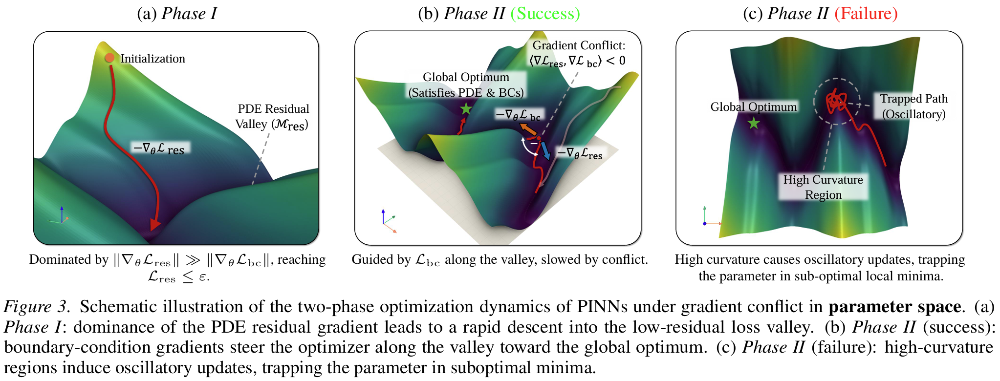

# CAML: Constraint-Aligned loss with Manifold Lifting

[](https://icml.cc/virtual/2026/poster/65216)
[](https://icml.cc/virtual/2026/poster/65216)
[](LICENSE)

Code for paper **Mitigating Gradient Pathology in PINNs through Aligned Constraint**, presented at the _43rd
International Conference on Machine Learning (ICML 2026)_.

CAML is designed to mitigate gradient pathology in PINN training, especially the gradient conflict between PDE residual
losses and boundary-condition losses. By reformulating zeroth-order terms into aligned constraints and introducing a
delayed residual loss, CAML improves the numerical stability, convergence speed, and robustness of PINNs on complex PDE
problems.

## Overview

Physics-Informed Neural Networks (PINNs) solve partial differential equations by minimizing a combination of PDE
residual losses and boundary-condition losses. However, in many practical problems, these two loss terms may induce
conflicting gradients, making optimization unstable or trapping the model in poor local minima.



CAML addresses this issue from the perspective of loss geometry and optimization dynamics.

The key idea is to enlarge the admissible solution space by introducing an explicitly solvable offset for zeroth-order
terms, allowing the model to better align PDE and boundary constraints during training.

## Getting Started

CAML is implemented in PyTorch and does not require any additional specialized dependencies beyond the standard PyTorch
environment.

To reproduce the experimental results reported in the paper, please run the corresponding evaluation scripts:

- `eval_heat.py` for the Heat benchmark
- `eval_poisson.py` for the Poisson benchmark
- `eval_ns.py` for the Navier-Stokes benchmark
- `eval_helm.py` for the Helmholtz benchmark

The hyperparameter settings used in the experiments are provided in Appendix L.2 of the paper.

## Project Structure

```text
CAML/
├── backbone/                 # Neural network backbones used in the experiments
│   ├── mlp.py
│   ├── pinnsformer.py
│   └── piratenet.py
├── benchmark/                # Benchmark-specific PDE and boundary-condition definitions
│   ├── heat/
│   │   ├── boundary_heat.py
│   │   └── pde_heat.py
│   ├── helm/
│   │   ├── boundary_helm.py
│   │   └── pde_helm.py
│   ├── ns/
│   │   ├── boundary_ns.py
│   │   └── pde_ns.py
│   └── poisson/
│       ├── boundary_poisson.py
│       └── pde_poisson.py
├── boundary.py               # Common boundary-condition utilities
├── pde.py                    # Common PDE-related utilities
├── pinn.py                   # Standard PINN components
├── caml.py                   # CAML loss implementation
├── eval_heat.py              # Evaluation script for the Heat benchmark
├── eval_poisson.py           # Evaluation script for the Poisson benchmark
├── eval_ns.py                # Evaluation script for the Navier-Stokes benchmark
├── eval_helm.py              # Evaluation script for the Helmholtz benchmark
└── readme.md
```

## Supported Benchmarks

The paper evaluates CAML on representative PDE problems from thermodynamics, fluid mechanics, and electromagnetism:

| Benchmark     | Description                                                                   |
|---------------|-------------------------------------------------------------------------------|
| Heat          | Heat conduction with composite boundary conditions                            |
| Poisson       | Poisson equation with complex nonlinear boundary conditions                   |
| Navier-Stokes | Steady-state Navier-Stokes problem with nonlinear operators                   |
| Helmholtz     | Helmholtz reaction-diffusion problem with complex geometry and high frequency |

## Supported Backbones

CAML can be integrated into different PINN architectures:

* MLP-based PINN
* PirateNets
* PINNsFormer
* Other custom neural PDE solvers

## Citation

If you find this repository useful, please cite:

```bibtex
@inproceedings{luo2026mitigating,
  title     = {Mitigating Gradient Pathology in PINNs through Aligned Constraint},
  author    = {Luo, Yichen and Zhu, Peiyu and Hu, Dongxiao and Wang, Jia and Wu, Tailin and Lan, Dapeng and Liu, Yu and Pang, Zhibo},
  booktitle = {Proceedings of the 43rd International Conference on Machine Learning},
  year      = {2026}
}
```

## Acknowledgements

This repository is built upon the following open-source projects:

- [PinnsFormer](https://github.com/AdityaLab/pinnsformer)
- [PirateNets](https://github.com/PredictiveIntelligenceLab/jaxpi/tree/pirate) (The original code of PirateNets was
  implemented using JAX. We have translated it into a PyTorch version.)